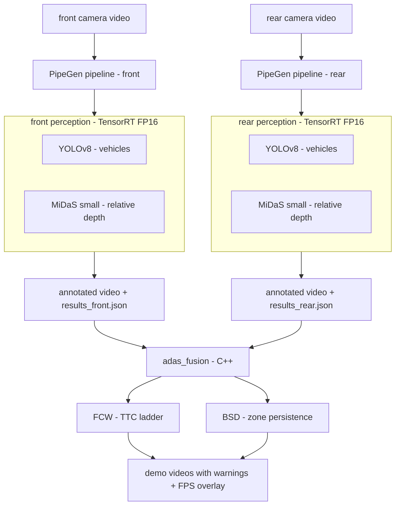

# adas-lite — FCW + BSD stack built with PipeGen

A lightweight L2 driver-assist prototype: **Forward Collision Warning** (front
camera) and **Blind Spot Detection** (rear camera) from plain video, using
TensorRT **FP16** perception generated with
[CraftifAI PipeGen](https://developer.craftifai.com) and a small **C++**
decision layer. Algorithm shapes and thresholds follow the ADAS_modular v3.3
reference stack (read-only inspiration).

## What it does

- **FCW**: tracks the lead vehicle in the ego corridor, estimates range by
  fusing MiDaS relative depth with a bbox pinhole anchor, computes TTC from the
  closing rate, and raises warn/critical banners on the v3.3 TTC ladder.
- **BSD**: watches trapezoidal blind-spot zones on the rear view; a vehicle
  that persists in a zone for N frames raises a left/right blind-spot warning.
- Every demo frame carries live **FPS metrics** and detection overlays.

## Architecture



## Models (all TensorRT FP16, chosen for speed)

| Task | Model | Engine | Source |
|---|---|---|---|
| Vehicle detection (front + rear) | YOLOv8 (ONNX) | `yolov8m.fp16.engine`, 55 MB | PipeGen benchmark catalog |
| Monocular depth (front + rear) | MiDaS v2.1 small | `midas_small.fp16.engine`, 36 MB | PipeGen benchmark catalog |

Compiled on an RTX 5060 Laptop (Blackwell, sm_120) with TensorRT 10.8 — see
`docs/` for the container fix that makes Blackwell work with the stock
DeepStream 7.1 image.

## Decision layer (v3.3-derived parameters)

| Function | Trigger | Thresholds |
|---|---|---|
| FCW | TTC to lead below ladder | warn 3.2 s, critical 2.3 s, range ≤ 40 m, cooldown 2 s |
| BSD | vehicle persists in blind-spot zone | critical 2.5×5 m / overtake 8×5 m equivalents, 10-frame persistence, leaky decay |

Range estimation: per frame, `scale = median(pinhole_i × midas_i)` over
detected vehicles, then `range_i = scale / midas_i` — MiDaS supplies relative
structure, the bbox pinhole supplies absolute scale.

## The exact prompt given to PipeGen

> I am building a lightweight L2 ADAS perception stack for a dual-camera
> vehicle setup, running real-time on edge hardware. Inputs: two video files,
> front camera front.mov and rear camera rear.mov, no physical cameras. Tasks:
> vehicle detection and monocular depth estimation on both cameras as
> independent parallel tasks. Use the lightest and fastest benchmark models
> available: the compact YOLOv8 ONNX repo for vehicles and MiDaS small for
> depth. Compile every engine in FP16. Outputs: no live display window — write
> the processed annotated video to a file, and also write every detection to
> JSON with per-frame objects including class, confidence, bounding box,
> per-object depth value, so a downstream module can compute FCW and BSD.
> Any scene condition is possible including night and rain.

(The conversational flow — source selection, PIR review, FP16 compilation and
benchmark/accuracy reports — is captured in `docs/screenshots/`.)

## What was built on top of PipeGen

- `adas/` — **adas_fusion** (C++17, OpenCV + nlohmann-json): FCW TTC + BSD
  zone logic, monocular range fusion, warning banners, FPS overlay rendering.
- `pipelines/perception.py` — TensorRT FP16 runner (polygraphy) mirroring the
  PipeGen pipeline output schema, used to iterate while the PipeGen session
  compiled; produces identical `results.json` + annotated video.
- Blackwell (sm_120) container fix: TensorRT 10.3 → 10.8 upgrade of the
  DeepStream 7.1 image (stock image fails with `Unsupported SM: 0xc00`).

## Demos

All demo videos are saved in the [`demos/`](demos/) directory:

| File | Shows |
|---|---|
| [`demos/live_sidebyside.mp4`](demos/live_sidebyside.mp4) | **front FCW and rear BSD side by side** — the main demo |
| [`demos/screen_recording.mp4`](demos/screen_recording.mp4) | terminal launching the pipeline and playing the result |
| [`demos/demo_front_fcw.mp4`](demos/demo_front_fcw.mp4) | FCW on dashcam front view — lead tracking + TTC + range |
| [`demos/demo_rear_bsd.mp4`](demos/demo_rear_bsd.mp4) | BSD blind-spot zones on rear view |
| [`demos/demo_carla_fcw.mp4`](demos/demo_carla_fcw.mp4) | same pipeline, unchanged, on CARLA simulator footage |

Reproduce the side-by-side demo with one command:

```bash
./run_demo.sh                       # uses the bundled front/rear clips
./run_demo.sh my_front.mp4 my_rear.mp4   # or your own
```

## CARLA

The pipelines are camera-agnostic: `demos/demo_carla_fcw.mp4` is CARLA
simulator footage passed through the identical engines + decision layer.
CARLA 0.9.15 is installed under `~/carla` for live-bridge work: a
`sensor.camera.rgb` callback feeding frames into the same pipeline input is
the documented next step in `sim/`.

## Build & run

```bash
# 1. FP16 engines (inside the PipeGen DeepStream container)
trtexec --onnx=models/yolov8m.onnx --fp16 --saveEngine=pipelines/engines/yolov8m.fp16.engine
trtexec --onnx=models/midas_v21_small.onnx --fp16 --saveEngine=pipelines/engines/midas_small.fp16.engine

# 2. perception (container): annotated video + JSON
python3 pipelines/perception.py front.mov out/front_annotated.mp4 out/results_front.json \
        pipelines/engines/yolov8m.fp16.engine pipelines/engines/midas_small.fp16.engine

# 3. decision layer + demo render (host)
cd adas && mkdir -p build && cd build && cmake .. && make
./adas_fusion --mode front --video front.mov --json out/results_front.json --out demos/demo_front_fcw.mp4
./adas_fusion --mode rear  --video rear.mov  --json out/results_rear.json  --out demos/demo_rear_bsd.mp4
```
